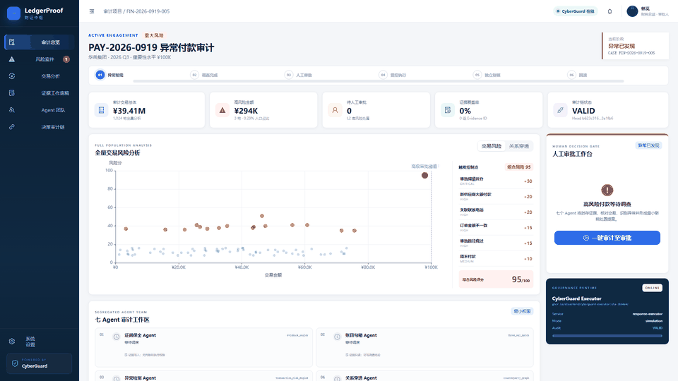
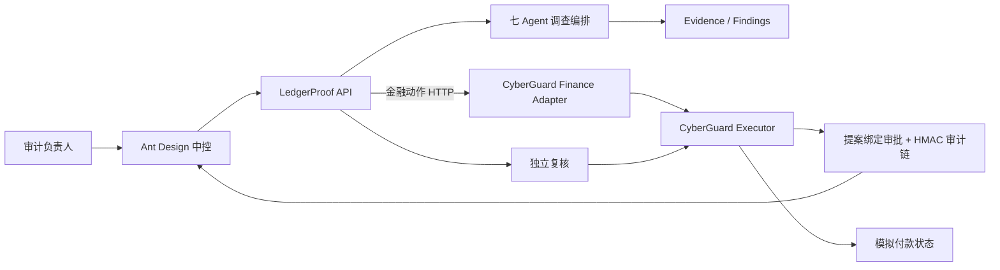

# LedgerProof · 财证中枢

> 基于 [CyberGuard](https://github.com/elsechord/CyberGuard) 治理底座迁移出的金融审计智能体中控：七个权限隔离 Agent 完成调查，人类批准高风险动作，独立复核 Agent 验证结果，全部关键决策进入可校验哈希证据链，并支持受控回滚。



## 为什么选择金融审计

付款审计与 CyberGuard 的核心能力高度匹配：证据必须可追溯，高风险动作必须由人批准，执行范围必须严格受限，结果需要独立复核，错误动作还要能够回滚。演示案例只暂停 1,024 笔交易中的 3 笔异常付款，影响金额 ¥294,000。

## 一条完整、可演示的决策链

1. **全量审计**：对 1,024 笔交易执行风险评分，定位三笔 ¥98,000 的阈值拆分付款。
2. **多 Agent 调查**：七个 Agent 按权限读取证据、勾稽账目、穿透关系、检查内控并形成最小影响提案。
3. **人工决策门**：财务负责人看到证据范围、风险理由和提案哈希后批准；批准只绑定当前提案。
4. **受控执行**：CyberGuard 校验批准、有效期和提案哈希后，执行异常付款批次的模拟止付。
5. **独立复核**：复核 Agent 重新读取付款状态，逐项核对交易范围、金额、证据根和审计链。
6. **受控回滚**：人工填写理由后释放止付，历史审计记录保留，原复核结论被显式标记为失效。

## 七个 Agent

| 顺序 | Agent | 职责 | 权限边界 |
|---:|---|---|---|
| 1 | 证据保全 Agent | 封存总账、发票、订单、供应商与审批日志 | 仅写 Evidence ID，无判断和执行权限 |
| 2 | 账目勾稽 Agent | 核对订单、发票、总账与付款 | 证据只读，可写调查结论 |
| 3 | 异常检测 Agent | 全量交易风险评分 | 交易只读，只调用确定性评分工具 |
| 4 | 关系穿透 Agent | 调查人员、供应商和收款账户关系 | 仅访问脱敏关系图，无审批权限 |
| 5 | 内控合规 Agent | 检查审批阈值、供应商复核和职责分离 | 规则与审批日志只读 |
| 6 | 处置规划 Agent | 汇总结论，形成最小影响止付提案 | 只能提案，不能批准或执行 |
| 7 | 独立复核 Agent | 重新验证执行状态与审计链 | 只读付款状态和审计账本 |

## CyberGuard 是怎样被复用的

LedgerProof 的 `cyberguard-governance` 容器直接派生自：

```text
ghcr.io/elsechord/cyberguard-executor:sha-3b34e4c
```

`adapter/finance_adapter.py` 只增加金融动作语义与付款状态回执，继续调用底座原有的批准绑定、有效期校验、HMAC 审计链、动作历史和回滚能力。LedgerProof API 通过 HTTP 调用这个容器，不在自身进程内复制一套“看起来相同”的审计链。

完整说明见 [CyberGuard 运行时复用](docs/CYBERGUARD_RUNTIME_REUSE.md) 和 [演示事实边界](docs/DEMO_TRUTH_BOUNDARY.md)。

## 快速启动

### 1. 获取 CyberGuard 镜像权限

如果 GHCR 包为公开状态，Docker 会直接拉取。若包仍为私有状态，先登录有读取权限的 GitHub 账号：

```bash
docker login ghcr.io
```

推荐把 `elsechord/CyberGuard` 的 `cyberguard-executor` package 改为 Public，比赛演示机便可免登录启动。

### 2. 启动三个容器

```bash
git clone https://github.com/armaygooser/LedgerProof.git
cd LedgerProof
docker compose up --build
```

打开：<http://127.0.0.1:18866>

| 服务 | 地址 | 用途 |
|---|---|---|
| LedgerProof Web | `127.0.0.1:18866` | Ant Design 金融审计中控 |
| LedgerProof API | `127.0.0.1:18865` | 案件状态机与七 Agent 编排 |
| CyberGuard Governance | `127.0.0.1:18805` | 审批、执行、审计链、回滚 |

首次打开后点击 **一键审计至审批**，再依次点击人工批准、执行、独立复核与回滚。详细讲解词见 [演示手册](docs/DEMO_RUNBOOK.md)。

## 架构



参见 [技术架构](docs/ARCHITECTURE.md)。

## 验证

```bash
# 完整容器流程：重置 → 调查 → 批准 → 执行 → 复核 → 回滚
python scripts/smoke_http.py

# 后端
python -m pytest
python -m ruff check backend adapter

# 前端
cd frontend
npm test -- --run
npm run build
```

当前验证结果：后端 2 项测试通过，前端 2 项测试通过，正式构建通过；容器端到端流程产生 7 条连续审计记录并成功校验、复核和回滚。

## 项目结构

```text
adapter/       CyberGuard 派生镜像与金融领域适配层
backend/       案件状态机、七 Agent、数据与 HTTP API
domainpack/    可迁移的金融审计领域包
frontend/      React + Ant Design 中控页面
agentteams/    AgentTeams Worker 与 Element 演示资料
docs/          架构、事实边界、运行和录屏手册
release/       演示动图与截图
```

## 演示事实边界

真实运行的部分包括容器间 HTTP 调用、提案哈希绑定、批准有效期、HMAC 链、动作历史、独立复核记录和回滚失效语义。当前交易集、Agent 推理结果和付款执行器是确定性演示实现，未连接真实 ERP、银行付款通道或线上大模型。页面会将运行模式显示为 `simulation`。

## License

Apache-2.0
