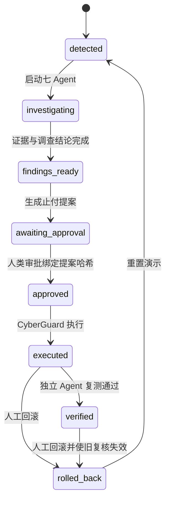
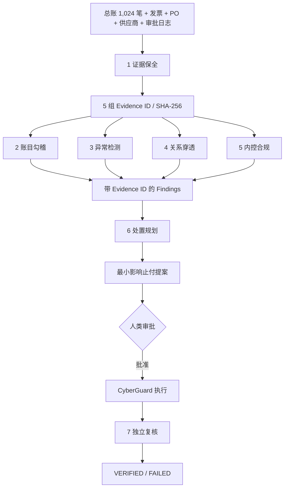

# LedgerProof 技术架构

## 设计目标

LedgerProof 证明 CyberGuard 的“可信决策基座”可以脱离网络安全语义，迁移到金融审计场景，同时保留权限隔离、证据绑定、人工审批、独立复测和可回滚执行。

## 组件

| 组件 | 技术 | 责任 |
|---|---|---|
| `ledgerproof-web` | React、Ant Design、ECharts、Nginx | 风险分析、Agent 状态、人工审批、哈希链与回滚交互 |
| `ledgerproof-api` | FastAPI | 案件状态机、七 Agent 编排、证据与风险数据、调用治理端口 |
| `cyberguard-governance` | CyberGuard Executor 派生镜像 | 提案持久化、审批绑定、受控执行、HMAC 链、复核记录与回滚 |
| volume | Docker volume | 保存 CyberGuard 审计账本和金融动作状态 |

## 状态机

## 七 Agent 数据流

## 权限隔离

- 调查 Agent 不持有审批凭据，也没有执行 API 权限。
- 处置规划 Agent 只能形成提案，无法批准或执行。
- 人类批准由后端携带独立审批密钥提交，并绑定 `proposal_record_sha256`。
- 执行端再次校验动作状态、批准有效期和提案绑定关系。
- 独立复核使用单独的 verifier token，只读取执行后状态并追加复核记录。
- 回滚需要人工身份与理由，且保留原执行记录。

## 证据和决策的两层哈希

1. **业务证据层**：每组输入生成 SHA-256；Agent 输出和证据集合形成 `evidence_root_sha256`。
2. **治理审计层**：CyberGuard 对提案、批准、执行、复核和回滚逐条计算记录 SHA-256、前序记录哈希与 HMAC。

因此页面可以同时回答“这个判断依据哪些材料”和“这个动作是否沿着未被篡改的批准链执行”。

## 回滚语义

回滚不会删除执行记录。CyberGuard 追加核心回滚记录与金融领域释放回执；LedgerProof 将先前的独立复核标记为 `invalidated`。如果后续再次采取动作，必须重新形成提案、批准和复核。

## 迁移接口

新的领域只需要替换三层：

1. `domainpack`：证据类型、控制规则、动作白名单和复核断言。
2. Agent 调查实现：把领域数据转换为 Findings 与 Evidence ID。
3. CyberGuard adapter：把白名单动作映射到领域执行器，并写入动作回执。

人工审批、提案绑定、HMAC 链、动作历史、独立复核记录和回滚框架保持不变。
